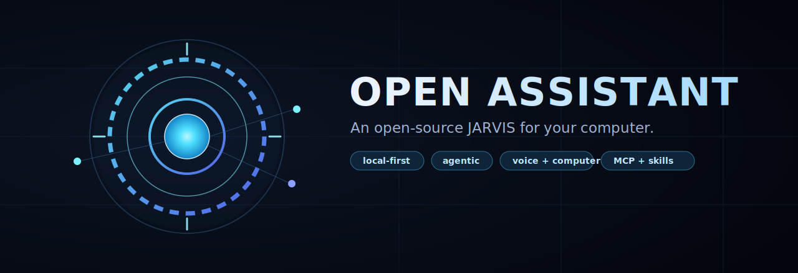
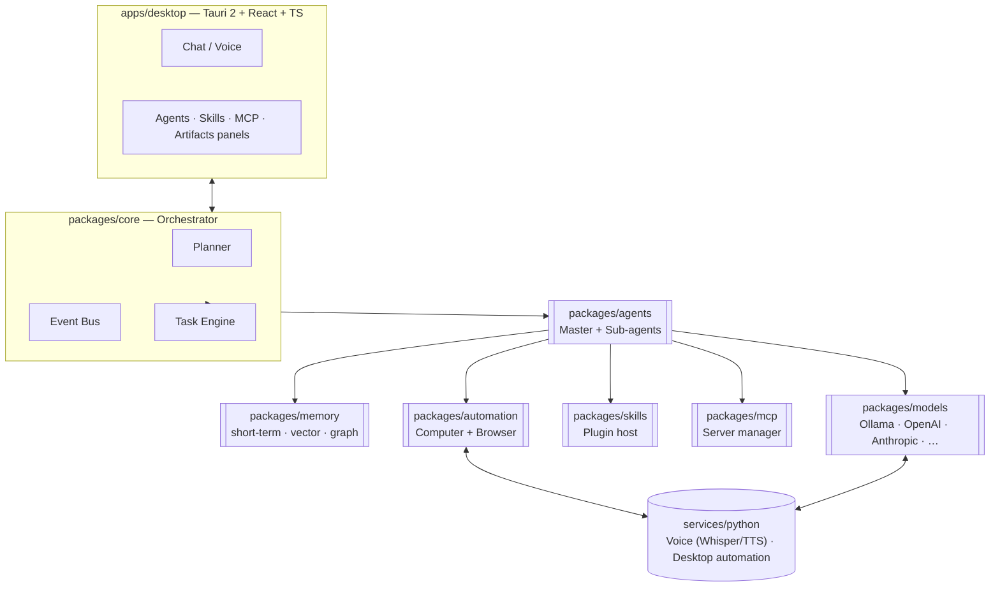

<!--
  ┌──────────────────────────────────────────────────────────────────────────┐
  │  AI / LLM READING THIS FILE: this README is the entry point and the map    │
  │  of the whole repository. Read the "Repository Map" section to locate any  │
  │  module without crawling every file. Contracts live in packages/shared.    │
  │  Deep design rationale lives in ARCHITECTURE.md.                           │
  └──────────────────────────────────────────────────────────────────────────┘
-->

<p align="center">
  
</p>

<h1 align="center">Open Assistant</h1>

<p align="center">
  <strong>An open-source, local-first, agentic personal assistant that operates your computer through conversation and voice.</strong><br>
  Think <em>JARVIS</em> — autonomous, multi-agent, and fully yours.
</p>

<p align="center">
  
  
  
  
  
  
</p>

---

## What is this

Open Assistant is an **AI-native operating layer** that sits above your OS and apps. Instead of clicking through interfaces, you tell it what you want — by text or voice — and it **plans, spawns specialized agents, executes, monitors, and reports back**.

It is built to be:

- **Open-source** — auditable, forkable, community-owned.
- **Local-first** — runs against local models (Ollama and any OpenAI-compatible endpoint) or cloud providers; your data and credentials stay on your machine.
- **Agentic** — a master agent orchestrates sub-agents (research, coding, design, browser, email, monitoring…) that merge their work into a single artifact.
- **Extensible** — capabilities arrive as **Skills** (plugins) and **MCP servers**, installable without touching core code.
- **For everyone** — shipped as a downloadable desktop app, usable without writing code.

> **Status:** pre-alpha. This repository currently contains the **architecture, type contracts, and module scaffolding**. The roadmap below describes what is being built. Contributions welcome.

---

## Inspiration

Open Assistant takes the best of several worlds and wraps them in native, Apple-grade simplicity:

| Inspiration | What we borrow |
|---|---|
| **JARVIS** (Iron Man) | Voice-driven, proactive, "operating system for your life" feel |
| **OpenClaw** | Agent / sub-agent orchestration doing real work autonomously |
| **Open Interpreter / OpenHands** | Computer control and code execution |
| **Manus / Devin** | Long-horizon autonomous task completion |
| **AutoGen / CrewAI** | Multi-agent collaboration patterns |
| **ChatGPT / Claude** | Conversation UX, projects, artifacts |

---

## Core capabilities

<table>
<tr>
<td valign="top" width="33%">

**Understand & talk**
- Natural-language requests
- Continuous voice mode + wake word
- Streaming responses, interruption
- Learns user preferences

</td>
<td valign="top" width="33%">

**Act on your machine**
- Mouse / keyboard / windows
- Screen reading + OCR
- Launch & drive applications
- Browser automation (Playwright)

</td>
<td valign="top" width="33%">

**Get things done**
- Documents, PDFs, slides, sheets
- Code projects & websites
- Research → report pipelines
- Recurring & monitoring tasks

</td>
</tr>
<tr>
<td valign="top">

**Agents**
- Dynamic agent creation
- Sub-agent spawning & merging
- Per-agent tools & permissions

</td>
<td valign="top">

**Integrations**
- WhatsApp / Telegram / Email
- MCP marketplace (install/enable)
- Skills plugin system

</td>
<td valign="top">

**Memory**
- Short-term conversation
- Long-term vector memory
- Knowledge-graph relationships

</td>
</tr>
</table>

A few things you should be able to say:

```
"Send a WhatsApp message to John."
"Open Blender, import this file and render it."
"Check my emails and summarize the important ones."
"Research RTX 5070 benchmarks and generate a report."
"Monitor Bitcoin and notify me if it drops below $80,000."
"Build a mobile app prototype and save it to my documents."
```

---

## Architecture at a glance



Full design rationale, data flows, and the dual-memory model are documented in **[ARCHITECTURE.md](ARCHITECTURE.md)**.

---

## 🗺️ Repository Map

> **This section exists so an AI agent or a new contributor can locate anything without reading the whole tree.** It mirrors the real structure. When you change the structure, update this map.

### Layout

```
Open-Assistant/
├── apps/
│   └── desktop/                  # Tauri 2 desktop app (the GUI)
│       ├── src/                  # React + TypeScript front-end
│       │   ├── components/       # Shared UI (layout, primitives)
│       │   ├── features/         # Feature folders: chat, agents, skills, mcp, artifacts
│       │   └── lib/              # Front-end utilities (IPC bridge to core/sidecar)
│       └── src-tauri/            # Rust shell: native windows, tray, sidecar spawn
│
├── packages/                     # Shared TypeScript libraries (the brains)
│   ├── shared/                   # ⭐ Type contracts & schemas — START HERE
│   │   └── src/types/            # agent · memory · model · skill · mcp · artifact · task
│   ├── core/                     # Orchestrator, planner, event bus, task engine
│   ├── agents/                   # Agent base class, registry, sub-agent spawning
│   ├── memory/                   # short-term · vector store · knowledge graph
│   ├── models/                   # Provider abstraction + concrete providers
│   ├── skills/                   # Skill (plugin) host & loader
│   ├── mcp/                      # MCP client + server lifecycle manager
│   └── automation/               # Computer-control & browser-control bridges
│
├── services/
│   └── python/                   # Python sidecar: voice (STT/TTS) + heavy automation
│       └── open_assistant_sidecar/
│           ├── voice/            # Whisper STT, Piper/Kokoro TTS
│           └── automation/       # Desktop control (screenshot, OCR, input)
│
├── docs/                         # getting-started, roadmap
├── assets/                       # banner.svg, logo.svg
├── ARCHITECTURE.md               # Deep design doc (read for contracts & data flow)
└── README.md                     # You are here
```

### Module responsibilities

| Package | Path | Responsibility | Key files |
|---|---|---|---|
| **shared** | `packages/shared` | Single source of truth for all cross-module types | `src/types/*.ts` |
| **core** | `packages/core` | Turn a goal into a plan; route events; run tasks | `orchestrator.ts`, `event-bus.ts` |
| **agents** | `packages/agents` | Define, register, run, and spawn agents | `agent.ts`, `registry.ts` |
| **memory** | `packages/memory` | 3-layer memory: conversation, vectors, graph | `short-term.ts`, `vector-store.ts`, `knowledge-graph.ts` |
| **models** | `packages/models` | Uniform `ModelProvider` API over local & cloud LLMs | `provider.ts`, `providers/*.ts` |
| **skills** | `packages/skills` | Load plugins, expose their actions/permissions | `skill-host.ts` |
| **mcp** | `packages/mcp` | Connect, configure, enable/disable MCP servers | `manager.ts` |
| **automation** | `packages/automation` | Computer + browser control (delegates heavy work to Python) | `computer.ts`, `browser.ts` |
| **desktop** | `apps/desktop` | The app users see; talks to core + sidecar | `src/App.tsx`, `src-tauri/src/main.rs` |
| **sidecar** | `services/python` | Voice + native automation that's easier in Python | `main.py`, `voice/`, `automation/` |

### "I want to change…" → go to

| Goal | Location |
|---|---|
| Add/modify a **data type or contract** | `packages/shared/src/types/` |
| Add a new **model provider** | `packages/models/src/providers/` + register in `provider.ts` |
| Add a new **agent role** | extend `BaseAgent` in `packages/agents/src/` + register in `registry.ts` |
| Change **planning / orchestration** | `packages/core/src/orchestrator.ts` |
| Add a **Skill (plugin)** | implement `SkillManifest` (see `packages/shared/src/types/skill.ts`) |
| Add an **MCP server** | configure via `packages/mcp/src/manager.ts` |
| Add **computer/browser actions** | `packages/automation/src/` (+ `services/python/.../automation/`) |
| Add **voice models** | `services/python/open_assistant_sidecar/voice/` |
| Change **UI / a feature screen** | `apps/desktop/src/features/<feature>/` |
| Change the **native shell / tray** | `apps/desktop/src-tauri/src/main.rs` |

### Conventions

- **Types first.** Every cross-package contract lives in `@open-assistant/shared`. Import types from there; never redefine them locally.
- **Packages are pure logic.** No UI in `packages/*`. No business logic in `apps/desktop` beyond wiring.
- **The Python sidecar is a service**, spoken to over a local IPC/RPC boundary — not imported. Treat it as a black box with a typed contract.
- **Permissions are explicit.** Any high-risk action (delete, send money, purchase, system change) must request approval — see the security model.
- Naming: `@open-assistant/<package>`, kebab-case files, PascalCase types, camelCase functions.

---

## Quick start

> Pre-alpha — these commands describe the intended developer workflow as the scaffold is filled in.

**Prerequisites:** Node ≥ 20, pnpm ≥ 9, Rust (stable) + Tauri prerequisites, Python ≥ 3.11, and [Ollama](https://ollama.com) for local models.

```bash
# 1. Install JS workspace deps
pnpm install

# 2. Set up the Python sidecar
cd services/python && pip install -e . && cd ../..

# 3. Pull a local model (optional, for local-first mode)
ollama pull qwen2.5

# 4. Run the desktop app in dev mode
pnpm --filter @open-assistant/desktop tauri dev
```

Then open the app, pick a model (local or cloud), and start talking.

---

## Tech stack

| Layer | Choice |
|---|---|
| Desktop shell | **Tauri 2** (Rust) |
| Front-end | **React · Next-style structure · TypeScript · Tailwind · shadcn/ui · Framer Motion** |
| Core / packages | **TypeScript** (pnpm workspaces) |
| Sidecar | **Python** (voice, OCR, native automation) |
| Models | **Ollama** + any OpenAI-compatible endpoint; OpenAI · Anthropic · Gemini · OpenRouter · Grok · DeepSeek |
| Memory | **pgvector** (vectors) + graph store; SQLite for local app state |
| Automation | **Playwright** (browser) + Computer-Use bridges |
| Voice | **Whisper / faster-whisper** (STT) · **Piper / Kokoro / ElevenLabs** (TTS) |

---

## Roadmap

The project ships in phases. Each phase is independently useful.

- **Phase 0 — Foundation** *(current)*: monorepo, type contracts, orchestrator skeleton, model provider abstraction, desktop shell.
- **Phase 1 — Talk & think**: chat UI, streaming, model switching mid-conversation, short-term + vector memory.
- **Phase 2 — Act**: computer control, browser automation, first Skills, MCP manager.
- **Phase 3 — Agents**: master/sub-agent orchestration, artifacts with version history.
- **Phase 4 — Voice**: continuous voice mode, wake word, interruption.
- **Phase 5 — Autonomy**: recurring/monitoring tasks, knowledge-graph memory, projects.
- **Phase 6 — Polish**: packaged installers, Skills marketplace, non-technical onboarding.

A more detailed breakdown lives in **[docs/roadmap.md](docs/roadmap.md)**.

---

## 🔐 Security model

The assistant must never become dangerous. Built-in from day one:

- **Permission scopes** per skill/agent — least privilege by default.
- **Approval workflows** — high-risk actions (delete files, send money, purchase, system changes) require explicit confirmation.
- **Sandboxed execution** for generated code and tool calls.
- **Secure credential vault** with local encryption — secrets never leave the machine.
- **Audit logs** of every action an agent takes.

---

## 🤝 Contributing

This is an early, ambitious project and help is very welcome. See **[CONTRIBUTING.md](CONTRIBUTING.md)** for how the repo is organized, coding conventions, and where to start. Good first areas: a model provider, a Skill, or a feature screen — each is self-contained thanks to the structure above.

---

## 📄 License

Released under the **MIT License** — see [LICENSE](LICENSE).
*(If stronger copyleft to keep all derivatives open is preferred, the project can move to AGPL-3.0.)*

---

<p align="center"><sub>Built to feel less like a chatbot and more like an intelligent digital operating system that understands goals and executes them.</sub></p>
